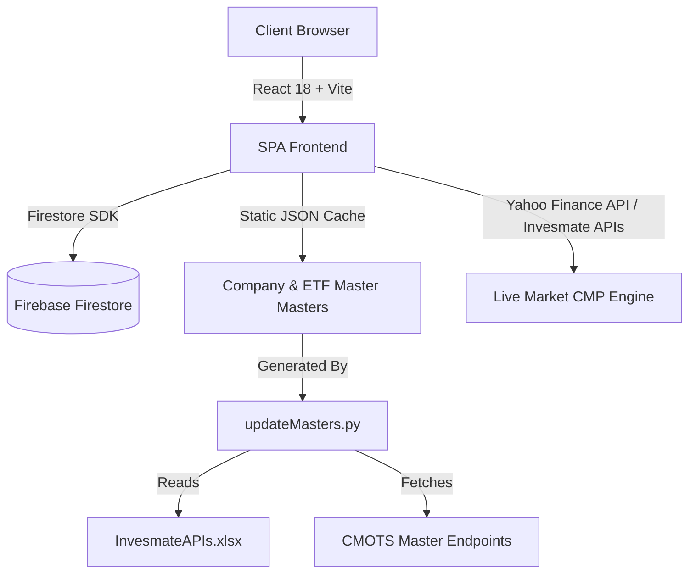

# North Wealth Portfolio Dashboard — System Architecture & Agent Harness (AGENTS.md)

## 1. 🛡️ CRITICAL MANDATE: CLIENT DATA IMMUTABILITY & PROTECTION

> [!CAUTION]
> **ZERO DATA LOSS POLICY:** Live client records, portfolio holdings, purchase dates, buy prices, transactions, and CRM metadata stored in Firebase Firestore are production assets. Under NO circumstances should any AI agent, automation script, or migration drop, bulk-delete, overwrite, or mutate production records without explicit human authorization.

- **Non-Destructive Operations Only:** Any database refactoring, feature addition, or schema update must be 100% backward-compatible.
- **Data Collections in Firestore:**
  - `clients`: Client master record (`id`, `name`, `email`, `phone`, `rm_name`, `risk_profile`, `onboarding_date`, `totalCapital`, `asset_equity`, `asset_mutual_funds`, `asset_free_cash`, `billed_amount`, `amount_paid`).
  - `holdings`: Stock and ETF positions for clients (`id`, `client_id`, `stock_symbol`, `nse_symbol`, `bse_code`, `isin`, `quantity`, `buy_price`, `invested_amount`, `current_price`, `current_value`, `source`, `purchase_date`).
  - `transactions`: Buy/Sell ledger history (`id`, `client_id`, `type`, `symbol`, `quantity`, `price`, `total_amount`, `date`, `realised_pnl`).
  - `market_data_cache`: Cached market prices and financial metrics from CMOTS / Yahoo Finance to avoid hitting rate limits.

---

## 2. 🏛️ System Architecture & Tech Stack



### Core Technologies:
- **Frontend Framework:** React 18, Vite, TypeScript
- **UI / Styling:** Custom Glassmorphism CSS Architecture, Lucide Icons, Plus Jakarta Sans & Inter Typography
- **Charts & Data Visualization:** Recharts (BarChart, PieChart, Treemap)
- **PDF & Export:** html2canvas + jsPDF (High-DPI vector-grade PDF generation)
- **Backend / Database:** Firebase Firestore (NoSQL Document Store)
- **Hosting:** Firebase Hosting (`https://north-wealth.web.app`)

---

## 3. 📂 Project Structure & Key Directories

```
north-wealth-dashboard/
├── AGENTS.md                   # This file (System Architecture & Agent Guidelines)
├── InvesmateAPIs.xlsx          # Invesmate / CMOTS Master Endpoints & API documentation
├── index.html                  # HTML entry point with Google Fonts (Plus Jakarta Sans, Inter)
├── package.json                # Dependencies and build scripts
├── vite.config.ts              # Vite bundler configuration
└── src/
    ├── main.tsx                # React DOM root entry
    ├── App.tsx                 # Root router and authentication wrapper
    ├── index.css               # Global Glassmorphism tokens, buttons, typography
    ├── components/
    │   ├── Layout.tsx          # App header navigation, logout, and layout wrapper
    │   ├── SummaryCard.tsx     # KPI stat cards with ambient glow
    │   ├── AddClientModal.tsx  # Add / Edit client modal (rendered via createPortal)
    │   ├── BulkOrderWizardModal.tsx # Multi-client Bulk Order wizard with Quick-Pick chips
    │   └── PnLBadge.tsx        # Green/Red P&L indicator badge
    ├── pages/
    │   ├── ClientsPage.tsx     # Client portfolio list and onboarding overview
    │   ├── ClientPortfolioPage.tsx # Single client portfolio table, statement parser, rebalancer
    │   ├── PortfolioDashboardPage.tsx # Institutional Wealth Portfolio Intelligence Report
    │   └── AnalyticsPage.tsx   # Cross-client analytics, stock search, free cash tracker, RM filters
    ├── lib/
    │   ├── firebase.ts         # Firebase initialization and db export
    │   ├── queries.ts          # Firestore client and holding query helpers
    │   ├── sectorMap.ts        # Fast symbol resolution, ISIN mapping, Sector classification
    │   ├── marketData.ts       # CMP fetching, caching, and batch price updater
    │   ├── yahooFinance.ts     # Yahoo Finance API connector for fallback CMP
    │   ├── companyMaster.json  # 6,600+ NSE/BSE company master tuples
    │   ├── etfMaster.json      # 348 ETF master records
    │   └── isinMap.json        # 3,800+ ISIN to NSE symbol mappings
    └── scripts/
        └── updateMasters.py    # Python script to sync master data from Invesmate/CMOTS
```

---

## 4. 🧭 Core Pages & Capabilities

### 1. `/` — Client Portfolios (`src/pages/ClientsPage.tsx`)
- Grid of client portfolios with avatar, client ID, RM badge, onboarding date, and active status.
- Add Client Modal with validation and immediate state refresh.
- Client deletion with confirmation dialog.

### 2. `/client/:id` — Client Portfolio View (`src/pages/ClientPortfolioPage.tsx`)
- **Holdings Table:** 15-column structured grid (Scrip, Sector, M.Cap, Qty, Buy Price, Invested, CMP, Current Value, Unrealised P&L, Alloc %, Source, Purchase Date, Actions).
- **Inline Editing:** Quick scrip symbol edit, buy price override, source toggle (Existing/Fresh), and purchase date picker.
- **Rebalance Mode:** Rebalancing capital overview, buy scrip calculator, inline sell modal, and real-time capital allocation breakdown (Equity, Mutual Funds, Free Cash).
- **Statement Import:** Drag-and-drop Excel/CAMS statement parser with automatic scrip and ISIN matching.
- **Transaction Ledger:** Chronological record of all executed trades.

### 3. `/client/:id/dashboard` — Portfolio Intelligence Report (`src/pages/PortfolioDashboardPage.tsx`)
- Executive Summary & Health Score.
- Gold-bordered Portfolio Snapshot Strip (AUM, Return %, Health, Beta, Mcap, Yield).
- Institutional At-a-Glance Metrics Grid (Investment summary, Top Sector Exposure, Top 5 Holdings %).
- Key Observations Auto-Generator.
- Sector & Industry Exposure Breakdown with custom color palettes.
- Conviction Tiers & Portfolio Depth Metrics (HHI concentration index).
- Estimated Annual & Monthly Dividend Income.
- High-resolution PDF Download.

### 4. `/analytics` — Cross-Firm Analytics (`src/pages/AnalyticsPage.tsx`)
- **Stock Lookup:** Instant search across all client portfolios to see who holds a given stock, total firm-wide quantity, average buy price, and combined P&L.
- **Free Cash Tracker:** Ranked list of clients with undeployed capital, quick filters (`≥₹1L`, `≥₹5L`, `≥₹10L`), and direct 1-click "Buy Stock" modal.
- **RM Breakdown:** Filter clients and AUM by Relationship Manager.
- **Risk Profile Search:** Filter clients by Aggressive, Moderate, Conservative profiles.
- **Sector Analytics & Firm-Wide Explorer:** Searchable asset aggregator across all clients.
- **Bulk Order Wizard:** 3-step bulk buy/sell wizard to execute trades across multiple selected clients simultaneously.

---

## 5. 🎨 UI & Design System Guidelines

- **Translucent Glassmorphism:**
  - All primary action buttons (`.btn-glass-gold`, `.btn-glass-green`, `.btn-glass-red`, `.btn-glass-light`) must maintain **translucent glass styling** (`rgba(..., 0.18)`), `backdrop-filter: blur(14px)`, and an inner top sheen (`inset 0 1px 1px rgba(255, 255, 255, 0.85)`).
  - Do NOT revert buttons to solid, opaque brown or muddy gradients.
- **Typography Standards:**
  - Font Family: `'Plus Jakarta Sans', 'Inter', sans-serif`.
  - Financial Values & Numbers: Always use `font-variant-numeric: tabular-nums` or the `.tabular-nums` class.
  - Normal/Medium Font Weights: Keep table numeric text at `400` / `500` weight (never heavy bulky 700/800 bold) for a sleek institutional look.
  - Single-Line Truncation: Scrip names, company names, and sectors must have `white-space: nowrap; overflow: hidden; text-overflow: ellipsis;`.
- **Modal Layering (React Portals):**
  - Any popup modal (`position: fixed; inset: 0`) **must** be rendered using `createPortal(..., document.body)`. This guarantees that modals are never trapped or pushed off-screen by parent CSS animations/transforms (`.animate-fade-in`).

---

## 6. ⚙️ Standard Operating Procedures (SOP) for Future Agents

1. **Refreshing Master Data from CMOTS:**
   ```powershell
   python src/scripts/updateMasters.py
   ```
2. **Testing Build Integrity:**
   ```powershell
   npm run build
   ```
3. **Deploying Updates to Firebase:**
   ```powershell
   git add .
   git commit -m "feat/fix: description of change"
   git push origin main
   & "C:\Users\Amarjeet Singh\AppData\Roaming\npm\firebase.cmd" deploy --only hosting --non-interactive
   ```
